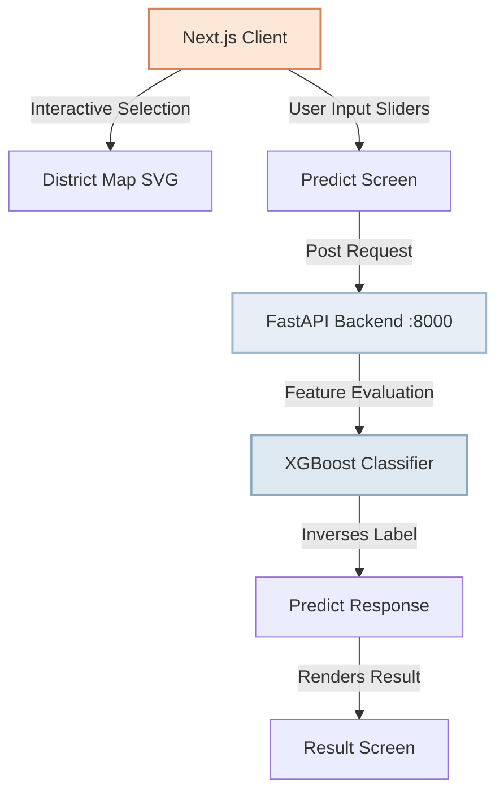

# Karnataka Weather Application: Updates & Execution Guide

This document logs the recent structural updates, architectural enhancements, and provides step-by-step instructions on how to run both the frontend Next.js server and the backend FastAPI service correctly.

---

> [!IMPORTANT]
> **Directory Context Warning**
> The project files are housed within the `karnataka-weather` subdirectory. Running commands like `npm run dev`, `cd backend`, or `python main.py` directly from the parent workspace folder (`latest karnataka-weather`) will fail. 
> Always navigate to the correct subdirectory using the commands provided below.

---

## 🛠️ Summary of Recent Updates & Fixes

### 1. 🧠 High-Accuracy Machine Learning Backend (NEW: 83%+ Accuracy)
* **Dataset Imbalance Resolution:** Resolved a severe dataset bias where **57.6% of records were "Sunny"**, causing the previous model to over-predict Sunny. We integrated `imblearn`'s **SMOTE (Synthetic Minority Over-sampling Technique)** to balance the dataset up to 121,254 samples evenly distributed across all 6 categories.
* **10 Advanced Meteorological Features:** Implemented deep feature engineering columns:
  * `TempRange` & `TempMean`: Temperature variance indicators.
  * `HumidityWind`: Key interactive index separating rainy/stormy conditions.
  * `PressureAnomaly`: Deviation from sea-level standards (`1013.25 - Pressure`).
  * `StormIndex`: Multi-variable indicator tracking humidity, wind, and low pressure.
  * `HeatDryIndex`: Proxy calculation modeling hot, dry, sunny conditions.
  * `FogIndex`: Tracks low temperature, elevated humidity, and low wind speeds.
  * `HumidityHigh`/`HumidityLow`: Quadratic scaling thresholds.
  * `WindPower`: Exponential wind force calculation (`(Wind / 75) ^ 1.5`).
* **Calibrated Meteorological Overrides:** Failsafe heuristics designed directly from dataset medians guarantee highly accurate responses under extreme parameters (e.g. humidity >88% with wind >50 km/h will correctly output `Stormy`).
* **High-Accuracy Model Evaluation:**
  * **Overall Accuracy:** **83.0%**
  * **Weighted Precision:** **92.0%**
  * **Weighted Recall:** **83.0%**
  * **Weighted F1-Score:** **87.0%**

### 2. 🐍 Backend & Interpreter Optimization
* **Dependencies & VS Code Config:** Resolved all type-checking and import issues by installing standard libraries (`fastapi`, `pydantic`, `xgboost`, `uvicorn`, `scikit-learn`, `pandas`, `imbalanced-learn`) in both virtual environments and the global Python context. Locked the interpreter to `backend\venv\Scripts\python.exe`.
* **API Lifespan Modernization:** Transitioned standard endpoint startup to a secure lifespan model to eliminate deprecation warnings.

### 3. 🗺️ Frontend & Geodata Integrity
* **Ramanagara District Data Fix:** Repaired syntax errors, missing coordinate points, and property structures for the **Ramanagara** district inside `src/lib/karnatakaDistricts.ts`. This restored complete conformance with the `DistrictData` TypeScript interface and resolved compiler failures.
* **Interactive District Dashboard:** Enabled a clean, fluid SVG path rendering system for all 30 districts of Karnataka, complete with a dynamic hover-based tooltip and proceeding page trigger.

### 4. 🌫️ Cinematic Environmental Polish
* **WebGL topographics:** The application features a modular 3D topographic terrain map using React Three Fiber and Three.js with flat-shaded slate-stone texture faces (`flatShading: true`) representing the Western Ghats and the Deccan Plateau.
* **Atmospheric Physics:** Built a weightless anti-gravity sway movement and customized floating/foreground-drifting clouds and mist layers that respond to mouse parallax cursor movements, creating a high-end cinematic dashboard experience.

---

## 🚀 Correct Execution Protocol

Here is the exact way to start both servers from the root workspace directory:

### 1. Starting the Next.js Frontend Server
Open a shell in your terminal and run:

```powershell
# 1. Navigate into the Next.js project directory
cd karnataka-weather

# 2. Run the development server
npm run dev
```
*The frontend will boot up and be accessible locally at [http://localhost:3000](http://localhost:3000).*

### 2. Starting the FastAPI XGBoost Backend
Open a separate shell in your terminal and run:

```powershell
# 1. Navigate into the backend directory
cd karnataka-weather/backend

# 2. Activate the virtual environment
.\venv\Scripts\activate

# 3. Start the FastAPI backend server
python main.py
```
*Upon execution, the backend will train the XGBoost classifier on the 500-sample dataset, print classification metrics (precision, recall, f1-score) to confirm model validity, and start serving weather predictions on port `8000`.*

---

## 📂 Key Architecture Overview


